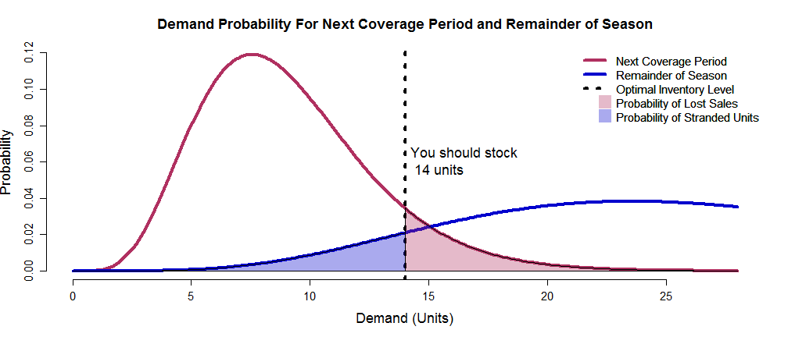

## Allocating seasonal retail goods to stores is a balancing act

- Seasonal retail products have a short life and generally a limited supply (think fashion apparel, for example)
- Goods are acquired prior to the start of the season, and held at a Distribution Center (DC)
- In-season, units are allocated out of the DC to stores on an as-needed basis
- How do we decide how many units to send to each store in each allocation cycle?
    - If we stock too many, we could end up with "stranded" inventory at the end of the season; if we can't return those to the vendor, then we take a loss on the cost of each stranded unit.
    - If we stock too few, we will lose out on sales during the next "coverage period"
    - The challenge: *find the level of inventory that balances those two risks*

--- .class #id 

## We can use probability theory to estimate the total costs at different stocking levels

- A gamma distribution is typically used to describe retail consumer demand
- Given the demand rate and variability of demand, we can determine the probability of selling a given number of units over a specified period of time
- For allocation, we are concerned with two time periods:
    - The next coverage period (time between arrival of shipments plus the transit time of an order from the DC to the store), and
    - The time remaining in the season
- The total cost associated with a stocking level *s* is the sum of:
    - Lost margin = pr(Coverage Period Demand > *s*) x (Unit Margin)
    - Obsolescence cost = pr(Remaining Season Demand < *s*) x (Unit Cost) x (Obsolescence %)
- Compute cost for each stocking level below cumulative probability <99.9%, then find the level with the lowest total cost

--- .class #id 

## The Optimizer Finds the Most Profitable Inventory Level Based On Input Parameters

### Example: Daily Demand = 1 unit, Coverage Period = 9 days, Remaining Season = 4 wks, Variability = 40%, Margin = 50%

--- .class #id 

## The Inventory Optimizer Is Available For Evaluation

- You can try it [here](https://leonardanalytics.shinyapps.io/seasonalinventoryoptimizer/)
- The code is available on [GitHub](https://github.com/dleonard1210/InventoryOptimizer)
- Go to the Help tab for definitions of the inputs and other notes
- Use the sliders to adjust input parameters and observe the effect on the optimal inventory level
- Ideas for future enhancements:
    - Support additional inputs, such as 
        - coverage period and remainder of season average daily demand
        - Item price or cost
        - Obsolescence cost (as % of item cost) - currently it assumes 100%
    - Integrate with forecasting system to directly access demand predictions and measure of variance

